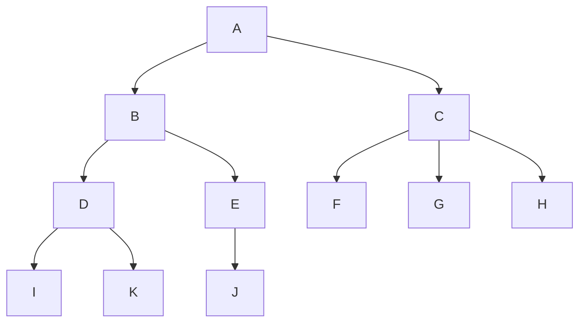
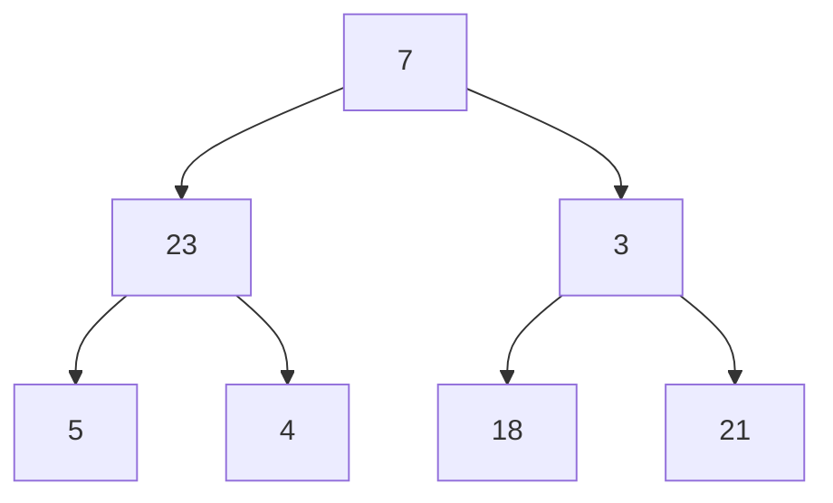
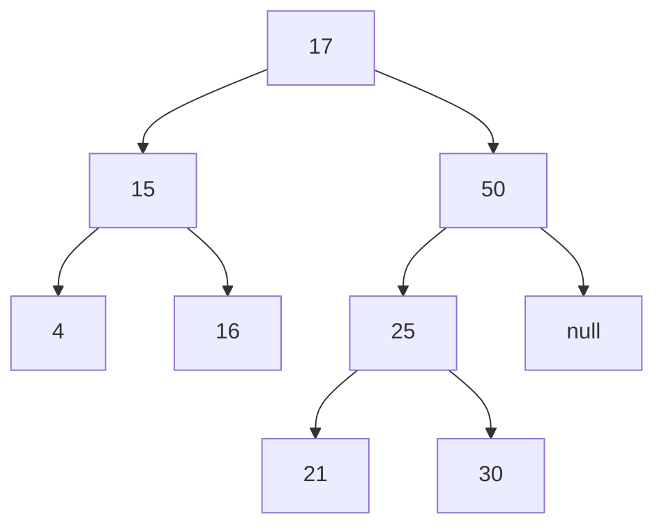
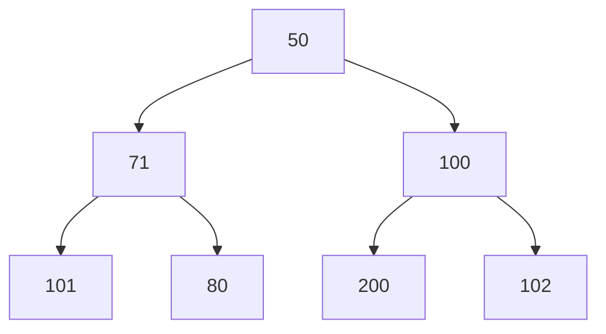

# Tree

 
 

## Root Node (Wurzelknoten)

Der Root Node ist der oberste Knoten in einem Baum oder der Knoten, der keinen
Parent Node (Elternknoten) hat. **A** ist der Root Node des Baumes. Ein nicht
leerer Baum muss exakt einen Root Node besitzen.

## Child Node (Kindknoten)

Ein Knoten, welcher der direkte Nachfolger eines Knoten ist, nennt man Child
Node. Die Knoten **D** und **E** sind Child Nodes von **B**.

## Parent Node (Elternknoten)

Ein Knoten, welcher der direkte Vorgänger eines Knoten ist, nenne man Parent
Node. Der Knoten **B** ist der Parent Node von **D** und **E**.

## Leaf Node (Blatt)

Ein Knoten, welcher keine direkten Nachfolger hat, nennt man Leaf Node. **I**,
**K**, **J**, **F**, **G** und **H** sind die Leaf Nodes des Baumes.

## Ancestor Node (Vorgänger)

Alle Vorgänger von einem Knoten bis einschließlich dem Root Node sind Ancestor
Nodes. **A** und **B** sind Ancestor Nodes des Knoten **E**.

## Descendant (Nachfolger)

Alle Nachfolger von einem Knoten sind Descendant Nodes. **D**, **I** und **K**
sind Descendant Nodes des Knoten **B**.

## Sibling (Geschwister)

Alle Child Nodes eines Knotens sind Siblings. **D** und **E** sind Siblings,
aber auch **F**, **G** und **H** sind Siblings.

## Level (Tiefe)

Die Anzahl der Kanten vom Root Node bis zu diesem Knoten beschreibt das Level.
Der Root Knoten hat immer das Level 0. **I** hat das Level 3, **G** das Level 2
und **B** hat das Level 1.

## Neighbor (Nachbar)

Ein Parent Node oder ein Child Node nennt man Neighbor eines Knoten. **B**,
**I** und **K** sind die Nachbarn des Knoten **D**.

## Subtree (Teilbaum)

Ein Teilbaum ist jeder Knoten im Baum mit seinen Nachfolgern. Alles Unterhalb
von **B** ist ein Subtree. Alles Unterhalb von **D** ist ein Subtree. Alles
Unterhalb von **E** ist ein Subtree. Alles Unterhalb von **C** ist ein Subtree.

# Binary Tree

 
 

## Depth First Search

- Pre Order Traversal: **7**, 23, 5, 4, 3, 18, 21
- In Order Traversal: 5, 23, 4, **7**, 18, 3, 21.
- Post Order Traversal: 5, 4, 23, 18, 21, 3, **7**.

### Code

Wenn unser aktueller Node null ist. Return Ansonsten recurse left, recurse
right.

## Breath First Search

- 7, 23, 3, 5, 4, 18, 21

# Binary Search Tree

 
 

# Heap

 
 

## Min Heap

Ein Min Heap hat immer an der obersten Stelle das kleinste Element. D.h. jeder
Descendant des Root Knotens ist größer oder gleich groß wie der Root Knoten.

## Max Heap

Ein Max Heap hat immer an der obersten Stelle das größte Element. D.h. jeder
Descendant des Root Knotens ist kleiner oder gleich groß wie der Root Knoten.

## Indizes

- Parent: (index - 1) / 2
- Left Child: 2 \* index + 1
- Right Child: 2 \* index + 2
